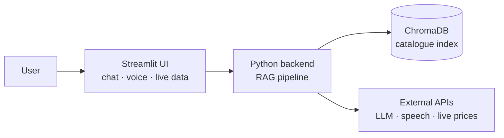
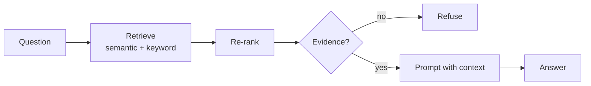

# Diagrams — BigBasket RAG Assistant

High-level only. Render at <https://mermaid.live> or in GitHub Markdown.

## Architecture

```mermaid
flowchart LR
    U["User"] --> UI["Streamlit UI<br/>chat · voice · live data"]
    UI --> APP["Python backend<br/>RAG pipeline"]
    APP --> DB[("ChromaDB<br/>catalogue index")]
    APP --> EXT["External APIs<br/>LLM · speech · live prices"]
```

## RAG pipeline

```mermaid
flowchart LR
    Q["Question"] --> R["Retrieve<br/>semantic + keyword"]
    R --> RR["Re-rank"]
    RR --> E{"Evidence?"}
    E -->|no| F["Refuse"]
    E -->|yes| P["Prompt with context"]
    P --> A["Answer"]
```
